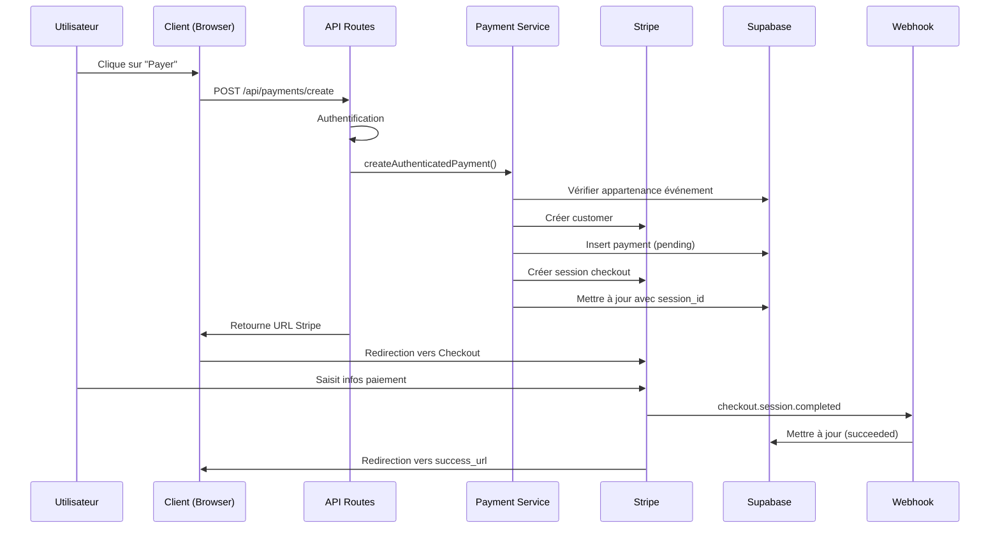
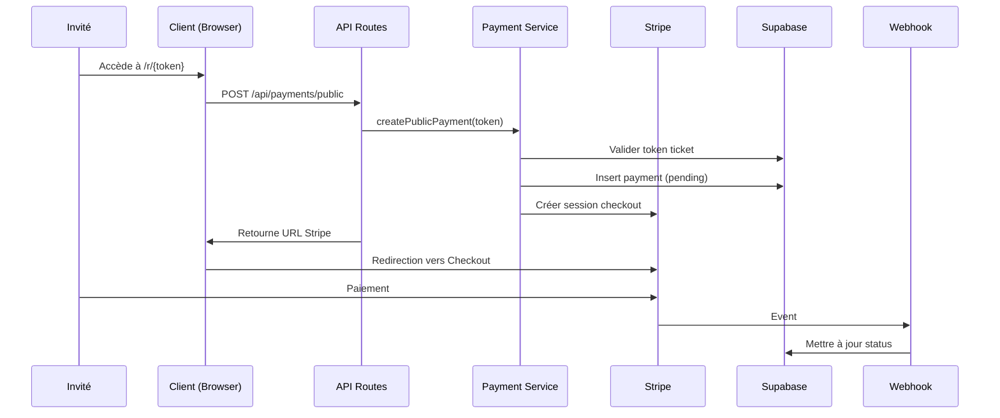

# 💳 Module de Paiement Stripe - Documentation

## Table des matières
1. [Vue d'ensemble](#vue-densemble)
2. [Architecture](#architecture)
3. [Flux de paiement](#flux-de-paiement)
4. [Configuration](#configuration)
5. [API Endpoints](#api-endpoints)
6. [Webhooks Stripe](#webhooks-stripe)
7. [Sécurité](#sécurité)
8. [Gestion des erreurs](#gestion-des-erreurs)
9. [Remboursements](#remboursements)
10. [Tests](#tests)
11. [Maintenance](#maintenance)

---

## Vue d'ensemble

Le module de paiement permet aux clients de payer les services de voiturier via Stripe Checkout. Il supporte deux modes de paiement :

- **Mode Privé** : Pour les utilisateurs authentifiés (valets/managers/admins)
- **Mode Public** : Pour les invités utilisant un token de ticket

### Fonctionnalités principales

✅ Paiement par carte bancaire, SEPA, Stripe Link
✅ Support des pourboires
✅ Génération automatique de factures
✅ Gestion des paiements asynchrones (SEPA)
✅ Remboursements complets et partiels
✅ Logging structuré pour audit
✅ Idempotence des webhooks
✅ Récupération fiable des reçus

---

## Architecture

### Structure des fichiers

```
src/
├── types/
│   └── payment.ts                    # Types TypeScript partagés
├── lib/
│   ├── stripe.ts                     # Instance Stripe server
│   ├── stripeClient.ts               # Instance Stripe client
│   └── logger.ts                     # Système de logging
├── services/
│   ├── payment.service.ts            # Logique métier des paiements
│   └── webhook.service.ts            # Gestion des webhooks
├── components/
│   └── PayButton.tsx                 # Composant bouton de paiement
└── app/api/payments/
    ├── create/route.ts               # POST /api/payments/create (privé)
    ├── public/route.ts               # POST /api/payments/public
    ├── refund/route.ts               # POST /api/payments/refund
    └── webhook/route.ts              # POST /api/payments/webhook
```

### Schéma de base de données

```sql
CREATE TABLE payments (
  id uuid PRIMARY KEY DEFAULT gen_random_uuid(),
  request_id uuid REFERENCES requests(id),
  event_id uuid NOT NULL REFERENCES events(id),
  valet_id uuid REFERENCES auth.users(id),

  -- Montants (en euros)
  currency varchar DEFAULT 'eur',
  service_amount numeric DEFAULT 0,
  tip_amount numeric DEFAULT 0,
  total_amount numeric GENERATED ALWAYS AS (service_amount + tip_amount) STORED,

  -- Stripe
  payment_method varchar,
  payment_status varchar DEFAULT 'pending',
  stripe_payment_intent_id text,
  stripe_session_id text,
  stripe_customer_id text,
  stripe_receipt_url text,

  -- Remboursements
  refunded_at timestamp with time zone,
  refund_amount numeric,
  refund_reason varchar,

  -- Métadonnées
  metadata jsonb DEFAULT '{}',
  last_webhook_event text,
  notes text,

  -- Timestamps
  paid_at timestamp with time zone,
  created_at timestamp with time zone DEFAULT now()
);
```

**Nouveaux champs requis** (ajoutés par cette mise à jour) :
- `refunded_at` : Date du remboursement
- `refund_amount` : Montant remboursé
- `refund_reason` : Raison du remboursement

**Migration SQL** :
```sql
-- Ajouter les colonnes de remboursement si elles n'existent pas
ALTER TABLE payments
  ADD COLUMN IF NOT EXISTS refunded_at timestamp with time zone,
  ADD COLUMN IF NOT EXISTS refund_amount numeric,
  ADD COLUMN IF NOT EXISTS refund_reason varchar;

-- Mettre à jour le type de payment_status pour inclure les nouveaux statuts
-- Note: Adapter selon votre configuration (ENUM ou VARCHAR)
```

---

## Flux de paiement

### 1. Mode Privé (Utilisateur authentifié)



### 2. Mode Public (Invité)



---

## Configuration

### Variables d'environnement

Créez un fichier `.env.local` :

```bash
# Supabase
NEXT_PUBLIC_SUPABASE_URL=https://your-project.supabase.co
NEXT_PUBLIC_SUPABASE_ANON_KEY=eyJhbGc...
SUPABASE_SERVICE_ROLE_KEY=eyJhbGc...

# Stripe (trouvez vos clés sur https://dashboard.stripe.com/apikeys)
STRIPE_SECRET_KEY=sk_test_51...
NEXT_PUBLIC_STRIPE_PUBLISHABLE_KEY=pk_test_51...
NEXT_PUBLIC_STRIPE_PK=pk_test_51...  # Alias pour PayButton

# Webhook (trouvez le secret sur https://dashboard.stripe.com/webhooks)
STRIPE_WEBHOOK_SECRET=whsec_...

# Application
NEXT_PUBLIC_APP_URL=https://your-domain.com  # ou http://localhost:3000
```

### Configuration Stripe Dashboard

1. **Créer un webhook** : https://dashboard.stripe.com/webhooks
   - URL : `https://your-domain.com/api/payments/webhook`
   - Événements à écouter :
     - `checkout.session.completed`
     - `checkout.session.async_payment_succeeded`
     - `checkout.session.async_payment_failed`
     - `checkout.session.expired`
     - `charge.succeeded`
     - `charge.refunded`
     - `payment_intent.payment_failed`

2. **Copier le signing secret** et l'ajouter à `STRIPE_WEBHOOK_SECRET`

3. **Activer les factures** :
   - Settings → Invoices → Enable automatic tax calculation (optionnel)

---

## API Endpoints

### POST /api/payments/create

Crée un paiement pour un utilisateur authentifié.

**Authentification** : Requise (cookie session Supabase)
**Autorisation** : Utilisateur doit être assigné à l'événement

**Body** :
```typescript
{
  eventId: string          // UUID de l'événement
  requestId?: string       // UUID de la demande (optionnel)
  serviceAmount: number    // Montant service en centimes (100-100000)
  tipAmount?: number       // Pourboire en centimes (0-50000)
  currency?: string        // Code devise (défaut: 'eur')
  notes?: string           // Notes additionnelles
}
```

**Réponse 200** :
```typescript
{
  url: string             // URL de redirection Stripe Checkout
  sessionId: string       // ID de la session Stripe
}
```

**Erreurs** :
- `400` : Payload invalide
- `401` : Non authentifié
- `403` : Non autorisé pour cet événement
- `500` : Erreur serveur

---

### POST /api/payments/public

Crée un paiement pour un invité (token-based).

**Authentification** : Aucune (validation par token)

**Body** :
```typescript
{
  token: string           // Token du ticket
  serviceAmount: number   // Montant service en centimes
  tipAmount?: number      // Pourboire en centimes
  notes?: string
}
```

**Réponse** : Identique à `/api/payments/create`

**Erreurs** :
- `400` : Token manquant ou montant invalide
- `404` : Token invalide ou expiré
- `500` : Erreur serveur

---

### POST /api/payments/refund

Crée un remboursement pour un paiement existant.

**Authentification** : Requise
**Autorisation** : Admin ou Manager uniquement

**Body** :
```typescript
{
  paymentId: string                                   // UUID du paiement
  amount?: number                                     // Montant en centimes (optionnel = total)
  reason?: 'duplicate' | 'fraudulent' | 'requested_by_customer'
  notes?: string
}
```

**Réponse 200** :
```typescript
{
  success: true
  refund: {
    id: string
    amount: number
    currency: string
    status: string
    reason: string | null
    created: number
  }
}
```

**Erreurs** :
- `400` : Paiement non remboursable (status ≠ succeeded)
- `401` : Non authentifié
- `403` : Rôle insuffisant
- `404` : Paiement introuvable
- `500` : Erreur serveur

---

### POST /api/payments/webhook

Endpoint de réception des événements Stripe (usage interne).

**Authentification** : Signature Stripe requise
**Content-Type** : `application/json`
**Headers** : `stripe-signature`

Ne doit **jamais** être appelé manuellement. Utilisé uniquement par Stripe.

---

## Webhooks Stripe

### Événements gérés

| Événement | Description | Action |
|-----------|-------------|--------|
| `checkout.session.completed` | Paiement synchrone réussi | Marque comme `succeeded` |
| `checkout.session.async_payment_succeeded` | Paiement async réussi (SEPA) | Marque comme `succeeded` |
| `checkout.session.async_payment_failed` | Paiement async échoué | Marque comme `failed` |
| `checkout.session.expired` | Session expirée (24h) | Marque comme `canceled` |
| `charge.succeeded` | Charge réussie | Récupère l'URL du reçu |
| `charge.refunded` | Remboursement effectué | Met à jour le statut |
| `payment_intent.payment_failed` | Paiement échoué | Marque comme `failed` |

### Idempotence

Les webhooks sont traités de manière idempotente :
- Chaque webhook stocke son `event.id` dans `last_webhook_event`
- Les webhooks déjà traités sont ignorés
- Protection contre les doublons en cas de retry Stripe

### Testing webhooks en local

Utilisez Stripe CLI :

```bash
# Installation
brew install stripe/stripe-cli/stripe

# Login
stripe login

# Forward webhooks vers localhost
stripe listen --forward-to localhost:3000/api/payments/webhook

# Dans un autre terminal, trigger un événement
stripe trigger checkout.session.completed
```

---

## Sécurité

### Mesures implémentées

1. **Validation des montants** :
   - Service : 1€ - 1000€ (100-100000 centimes)
   - Pourboire : 0€ - 500€ (0-50000 centimes)
   - Clamping automatique côté serveur

2. **Validation des tokens** :
   - Token UUID v4 valide
   - Token existe dans la base de données
   - Pas d'exposition de données sensibles

3. **Authentification & Autorisation** :
   - Mode privé : Session Supabase requise
   - Vérification de l'appartenance à l'événement
   - RBAC pour les remboursements (admin/manager)

4. **Webhook security** :
   - Validation de la signature Stripe
   - Vérification du timestamp (protection replay attacks)
   - Idempotence

5. **Logging** :
   - Logs structurés JSON
   - Pas de données sensibles (PII masquée)
   - Traçabilité complète des opérations

6. **Protection CSRF** :
   - Next.js gère automatiquement
   - Cookies httpOnly et secure

---

## Gestion des erreurs

### Côté client (PayButton)

Le composant `PayButton` affiche des toasts avec messages clairs :

- **Erreur réseau** : "Vérifiez votre connexion"
- **401** : "Vous devez être connecté"
- **403** : "Vous n'êtes pas autorisé"
- **404** : "Ticket introuvable"
- **Autres** : Message custom du serveur

### Côté serveur

Tous les endpoints retournent des erreurs structurées :

```typescript
{
  error: string        // Code d'erreur (ex: "Unauthorized")
  details?: string     // Message détaillé pour l'utilisateur
}
```

### Monitoring

Les logs sont disponibles via `console.log/error` (format JSON) :

```bash
# En production, intégrez avec un service de logging
# Exemples : Sentry, LogTail, DataDog, Logtail
```

Exemple de log :
```json
{
  "timestamp": "2025-01-15T10:30:00.000Z",
  "level": "info",
  "message": "Payment created successfully",
  "module": "payments",
  "userId": "uuid...",
  "eventId": "uuid...",
  "sessionId": "cs_test_..."
}
```

---

## Remboursements

### Depuis le code

```typescript
import { createRefund } from '@/services/payment.service'

// Remboursement total
const refund = await createRefund({
  paymentId: 'payment-uuid',
  reason: 'requested_by_customer',
  notes: 'Client a demandé le remboursement'
})

// Remboursement partiel
const partialRefund = await createRefund({
  paymentId: 'payment-uuid',
  amount: 1000, // 10€ en centimes
  reason: 'duplicate',
  notes: 'Doublon détecté'
})
```

### Via API

```bash
curl -X POST https://your-domain.com/api/payments/refund \
  -H "Content-Type: application/json" \
  -H "Cookie: sb-access-token=..." \
  -d '{
    "paymentId": "uuid...",
    "reason": "requested_by_customer"
  }'
```

### Statuts de remboursement

| Status | Description |
|--------|-------------|
| `succeeded` | Paiement réussi (pas de remboursement) |
| `partially_refunded` | Remboursement partiel effectué |
| `refunded` | Remboursement total effectué |

---

## Tests

### Test du flux complet

1. **Démarrer le serveur** :
   ```bash
   npm run dev
   ```

2. **Utiliser les cartes de test Stripe** :
   - Succès : `4242 4242 4242 4242`
   - Décliné : `4000 0000 0000 0002`
   - Authentification requise : `4000 0025 0000 3155`

3. **Tester le webhook** :
   ```bash
   stripe listen --forward-to localhost:3000/api/payments/webhook
   stripe trigger checkout.session.completed
   ```

### Scénarios à tester

- [ ] Paiement privé réussi
- [ ] Paiement public réussi
- [ ] Paiement avec pourboire
- [ ] Paiement décliné
- [ ] Session expirée
- [ ] Paiement SEPA (async)
- [ ] Remboursement total
- [ ] Remboursement partiel
- [ ] Webhook replay (idempotence)
- [ ] Utilisateur non autorisé
- [ ] Token invalide

---

## Maintenance

### Checklist mensuelle

- [ ] Vérifier les webhooks non livrés (Stripe Dashboard)
- [ ] Analyser les paiements échoués
- [ ] Vérifier les logs d'erreurs
- [ ] Contrôler les montants clamped (tentatives de manipulation)
- [ ] Mettre à jour la version de Stripe (`npm update stripe`)

### Checklist annuelle

- [ ] Renouveler les clés API Stripe (si nécessaire)
- [ ] Audit de sécurité du code
- [ ] Vérifier la conformité PCI DSS
- [ ] Tester le plan de disaster recovery

### Résolution de problèmes

#### Webhook non reçu

1. Vérifier que l'URL webhook est accessible publiquement
2. Vérifier les logs Stripe Dashboard → Webhooks
3. Vérifier le `STRIPE_WEBHOOK_SECRET`
4. Tester avec `stripe trigger`

#### Paiement bloqué en "pending"

1. Vérifier si le webhook a été reçu (logs)
2. Vérifier le statut dans Stripe Dashboard
3. Si nécessaire, retrouver le payment_intent et mettre à jour manuellement :
   ```typescript
   import { updatePaymentStatus } from '@/services/payment.service'
   await updatePaymentStatus(paymentId, 'succeeded', {
     stripe_payment_intent_id: 'pi_...',
     paid_at: new Date().toISOString()
   })
   ```

#### Reçu non disponible

Le reçu est récupéré via deux sources :
1. `checkout.session.completed` (parfois indisponible)
2. `charge.succeeded` (plus fiable)

Si le reçu manque, attendez quelques minutes ou récupérez-le manuellement via Stripe Dashboard.

---

## Support

Pour toute question ou problème :
1. Consultez les logs applicatifs
2. Vérifiez le Stripe Dashboard → Logs
3. Contactez l'équipe de développement

---

## Changelog

### v2.0.0 (2025-01-15)
- ✅ **FIX CRITIQUE** : Paiements asynchrones marqués comme réussis (et non échoués)
- ✅ Ajout de l'idempotence des webhooks
- ✅ Service layer pour centraliser la logique métier
- ✅ Types TypeScript partagés
- ✅ Système de logging structuré
- ✅ Fonctionnalité de remboursement
- ✅ Récupération fiable de l'URL du reçu via `charge.succeeded`
- ✅ Support des méthodes de paiement (card, SEPA, Link)
- ✅ Amélioration de la gestion d'erreurs côté client
- ✅ Documentation complète

### v1.0.0 (2024-xx-xx)
- Implémentation initiale du module de paiement
- Support des paiements publics et privés
- Intégration Stripe Checkout
- Webhook de base

---

**Module développé avec ❤️ pour Valet SaaS**
